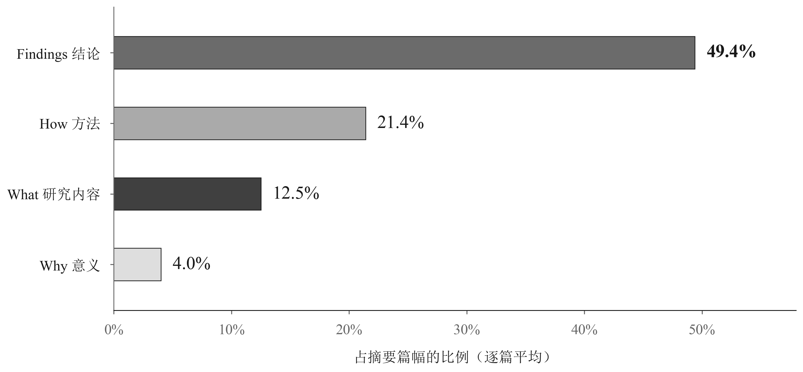
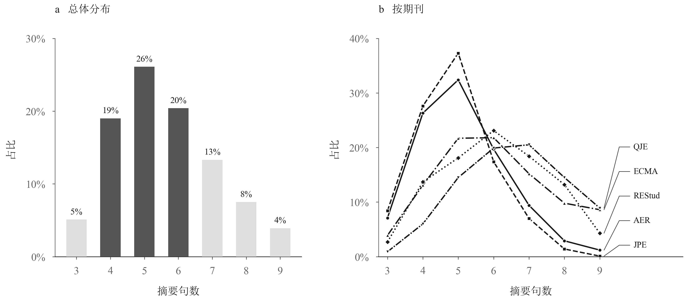
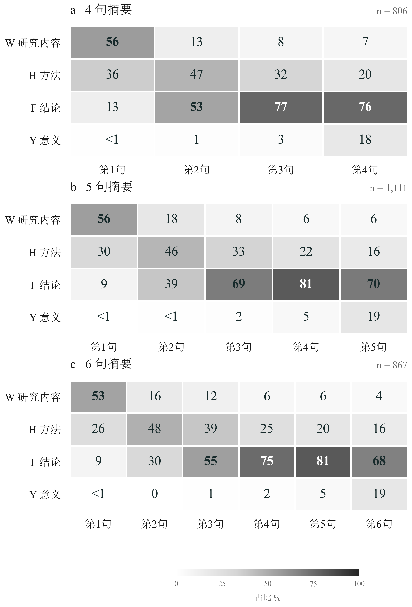
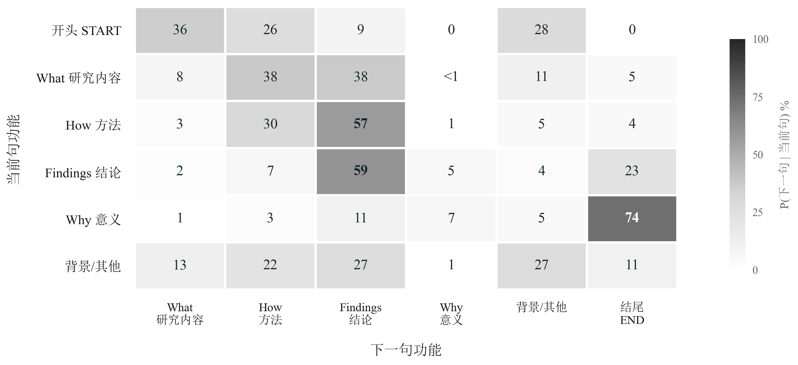
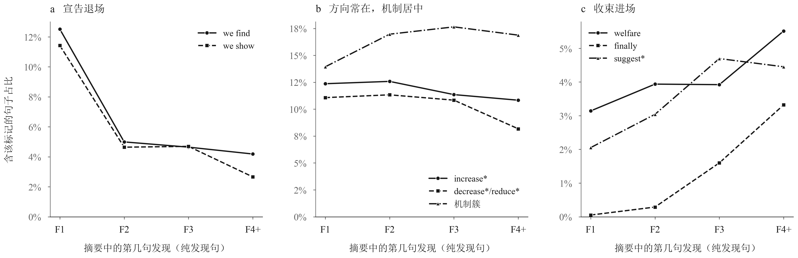
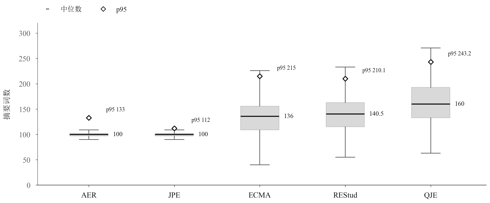

# 经济学论文摘要怎么写？我们深挖了4250篇Top5顶刊，给你总结出一个skill

在AI可以承担想idea、清洗数据、做回归的时代，还有一个环节困扰了广大研究者——**写作**。AI写出来的内容尽管加再多的skill还是不能看，最明显的问题是防御性写作（“注意xxx不能理解为xxx”）和莫名其妙的转折（“不是xxx，而是xxx”）。

frowang.com团队想看看能不能解决这个问题，于是我们发起了**AI writing lab**项目，项目的核心思路是，既然AI无法承担端到端（一句话生成一篇论文）的写作任务，能否拆开成一个部分一个部分去攻克？

今天和大家分享我们的第一篇研究成果，论文的第一部分——摘要怎么写。摘要和引言作为经济学论文最重要的两个部分，也是很多论文小白不断被导师打回重写的梦魇。

我们收集了2015—2026年间，AER、JPE、Econometrica、REStud、QJE五本经济学顶刊的4250篇摘要，用大模型逐句标注它们在做什么，再统计各类内容的篇幅、位置和衔接方式。结果非常有意思，4250篇摘要有着相当趋同的写作模式：摘要只有4-6句；第一句写研究问题第二句写研究方法，后面全部都是研究发现；摘要的平均词数只有100-200词等等。

这样的趋同模式告诉我们，在Top5这样全世界经济学最精华的论文里面，经济学家们对哪些部分重要具有共识，而这重要的部分就是findings（论文的发现）。在经济学这样一个“老登”学科，通常只有陪“老登”玩耍，跟随学科内的隐性规范，才能顺利拿到发表的大结果。

所以我们把这些发现炼成一个skill，交给因为写论文而脱发的你，不过请注意：这个skill是用经济学Top5顶刊炼出来了，并不适用于中文期刊和毕业论文的写作，不过管中窥豹，高水平论文的共识已经都在里面了。

以下，enjoy。

## 一、方法一句话交代清楚，论文发现充分展开

我们把摘要里的内容分为四类：研究什么问题（What）、怎样研究（How）、发现了什么（Findings）、这些发现意味着什么（Why，对应Why it matters）。

四类内容的平均篇幅差异很大：研究发现占**49.4%**，方法占21.4%，研究内容占12.5%，研究意义占4.0%。论文小白们最爱写的研究意义，反而很少有顶刊放在宝贵的摘要中。

## 二、摘要到底应该写几句话？

摘要到底应该写几句话呢？这4250篇摘要的句数中位数是5：五句摘要最多，占26.1%；六句占20.4%；加上四句的19.0%，**四到六句合计占65.5%**。

右图按期刊展示句数分布：AER和JPE两本短摘要的期刊句数高度集中，有超过30%的论文选择5句摘要，对于QJE、ECMA和REStud这三本较长摘要的期刊，分布又统一在6~7句。

因此，当你不知道要写几句摘要的时候，根据期刊要求的长短，写4~6是最稳妥的。如果你的摘要太长，也应该给自己敲敲警钟——是时候缩短摘要了。

## 三、五句话，怎样安排比较顺？WHFFF公式

我们把四句、五句、六句摘要分别放在一起，看每个位置通常承担什么功能。图中颜色越深，说明该位置越常出现这一类内容。Top5顶刊的写作公式，可以概括为**WHFFF**：第一句What、第二句How、第三句开始到结束都是Findings。

先看图中的1111篇五句摘要。

**第一句通常把研究问题放到读者面前。** 55.7%的第一句包含研究内容，29.6%包含方法。问题与方法也可以合写：“我们利用……研究……。”

**第二句是方法与发现交接的位置。** 45.5%包含方法，39.2%已经包含研究发现。数据和识别设计交代得快，结果就能更早出现。

**第三句到第五句，发现占据主要位置。** 这三个位置包含研究发现的比例，依次是68.9%、80.9%和69.9%。其中第四句最高，超过八成。

第五句里，研究意义的出现率升到了19.4%。不过，同一位置仍有69.9%的摘要在报告发现。

把这个分布用到自己的初稿里，可以先这样安排：

| 位置 | 这一句要完成的事 | 下笔时要想清楚的内容 |
|---|---|---|
| 第1句 | 交代研究问题 | 谁、什么变化、什么经济关系？ |
| 第2句 | 交代数据与方法 | 用什么材料和设计回答这个问题？ |
| 第3句 | 报告最重要的发现 | 最需要读者记住的结果是什么？能否给出量级？ |
| 第4句 | 展开关键发现 | 哪个结果最能解释、补充或改变对主结果的理解？ |
| 第5句 | 完成结果陈述或点明含义 | 还有哪个发现值得写？这些结果共同说明了什么？ |

这是一个便于起笔的安排。问题和方法合在第一句时，第二句就可以开始报告结果；识别设计需要展开时，也可以用两句交代清楚。

有了方法，还要看看真题，毕竟五年发表，三年模拟。以2026年6月的AER刊登的一篇关于Medicaid（美国医疗补助）私有化的实证论文为例，摘要共五句、98个词：

> 第一句：This paper examines the effects of privatizing social health insurance. 
>
> 第二句：We exploit a natural experiment in Medicaid, wherein nearly 100,000 enrollees were randomly assigned between a publicly operated fee-for-service system and private managed care. 
>
> 第三句：Managed care reduced costs by 5.6 percent via cost-effective substitutions among prescription drugs and via lower prices for outpatient services. 
>
> 第四句：We present evidence that pharmacy utilization management was the key mechanism reducing overuse and encouraging substitution to lower-cost drugs without decreasing observed quality. 
>
> 第五句：In contrast, privatizing medical benefits led to only modest savings and was associated with decreased health care quality and consumer satisfaction.

逐句对照上面的安排：

1. **研究问题：** “本文检验了私有化社会医疗保险的影响” 
2. **数据与方法：** “我们利用Medicaid的一次自然实验——近10万名参保人被随机分配到公立按项目付费体系和私人管理式医疗之间。” 自然而然在第二句引出核心设计（自然实验）和数据。
3. **主要发现（前半句量级，后半句原因）：** 管理式医疗使成本下降5.6%，来自处方药内部的低成本替代和更低的门诊服务价格。
4. **机制证据：** 药品使用管理是关键机制——减少了过度使用、促进了向低价药的替代，且观察到的药品质量没有下降。
5. **对照性结果：** 相比之下，医疗福利的私有化只带来有限的节省，还伴随着医疗质量和消费者满意度的下降。

第一句给问题，第二句把随机分配这个识别设计交代清楚，第三句先报主效应和量级，第四句补机制，第五句用一个对照性的结果收尾。三句发现连续展开，各自增加了新信息——与图3中五句摘要最常见的位置安排完全一致。（原文 The Private Provision of Public Services: Evidence from Random Assignment in Medicaid，AER 2026年第6期，DOI: 10.1257/aer.20230541。）

## 四、转移矩阵：写完上一句之后，下一句该写什么？

知道每一句放在哪里之后，还可以问得更细：写完一个功能，作者接下来通常写什么？

我们把相邻两句连接起来，得到下面这张转移矩阵。沿着一行读，就能看到当前句之后，各类内容出现的比例。START表示摘要开头，END表示摘要结束。和图3的固定八股句式不同，转移矩阵更灵活地告诉我们下一句该写什么。

**我们先看论文的第一句开头（START一行）。**36%的摘要拿研究内容作为第一句话，这一点和图3发现的结果一致。另有26%的首句主功能是方法——但这里的“方法”大多不是孤立的方法介绍，更多是“问题和方法合写在一句”。还有28%的摘要拿背景作为开头，就是我们常见的“研究空白”式开头。

这两种开头各长什么样？我们各找了一篇2026年的AER论文做示范。

**合写的首句：把方法揉进研究问题里。** 2026年3月的AER上，The Price of War 一文的首句：

> We assemble a new dataset spanning 150 years and 60 countries to study the economic toll of war.

“汇编一个横跨150年、60个国家的新数据集”（方法）和“研究战争的经济代价”（问题）在同一句话里一次交代完。这篇摘要共五句、99个词，首句合写之后，后面四句全部留给发现：先是主效应——战场国的产出下降近10%、物价上涨约20%；再是资本存量、生产率和股市回报的损失；最后两句报告战争经由贸易联系和共同边界向其他交战方和第三国的溢出。合写省下的篇幅，全部变成了结果。（The Price of War，AER 2026年第3期，DOI: 10.1257/aer.20241355。）

**背景开头：先给动机，但转折要快。** 2026年5月的AER上，一篇关于警察现场培训的研究这样开头：

> The influence of on-the-job training and supervisors, especially in high-stakes settings like policing, is poorly understood. Examining a central behavior in the debate surrounding police reform, we investigate the impact of a field training officer (FTO) on a recruit's use of force.

第一句只用16个词指出“知之甚少”，第二句立刻转到“我们研究什么”。随后第三句交代识别设计（近似随机的分配）并开始报告因果证据，第四句给出量级——培训官使用武力的倾向每高1个标准差，新警使用武力上升14%—18%，且持续至少两年；第五句点明改革含义。背景句可以写，但要短、转折快，快速接上WHFFF。（The Effect of Field Training Officers on Police Use of Force，AER 2026年第5期，DOI: 10.1257/aer.20240785。）

两种开头都能进顶刊，区别只在第一句花在哪儿：合写式开门见山，背景式先给动机。共同点是都很快进入发现。

还有一个很有趣的地方是How接How式摘要，30%的How下一句还是How，这种摘要怎么写呢？我们再来看一道真题，2026年2月QJE的 Marginal Returns to Public Universities的前两句：

> This article studies the returns to enrolling in U.S. public universities by comparing the long-term outcomes of barely admitted versus barely rejected applicants. I use administrative admission records spanning all 35 public universities in Texas, which collectively enroll 10% of all American public university students, to systematically identify and employ decentralized cutoffs in SAT/ACT scores that generate discontinuities in admission and enrollment.

发现了吗，其实并不是简单的How+How，而是第一句What+How（研究问题前半句，方法后半句），第二局再展开How。放在这篇论文里面别有深意：第一句"比较勉强被录取与勉强被拒申请者的长期结果"，熟悉实证方法的读者一眼就能看出这是断点回归；第二句再展开数据与执行细节：覆盖德州全部35所公立大学的行政录取记录，利用SAT/ACT分数线上分散的录取线构造断点。两句方法各司其职，之后连续四句全部是发现：先报主结果（多上一年学、学士学位概率提高12个百分点、收入高8%），再报成本收益（学生、社会、财政三口径的内部收益率）。

除了这几种不符合常规公式，其余都很符合：

**方法 → 发现：57.0%。** 方法交代完，下一步最常见的动作就是报告结果。读者刚知道你怎样回答问题，紧接着就能读到答案。

**发现 → 发现：59.4%。** 还记得我们的WHFFF公式吗？对于顶刊来说，发现Findings是最重要的，因此写完一个发现，作者往往接着写下一个，让结果连续展开。

**意义 → 结束：73.6%。** 当一句话的主功能是解释研究意义时，下一步约有四分之三的概率就是结束摘要。研究意义主要起到收尾的作用。

## 五、连续三句发现，分别怎么写？

到上一节为止，我们知道了摘要要留三句给发现。但三句发现该写什么内容？我们把每篇摘要里"只报告发现"的句子按出现顺序拆出来：第一句发现3947句、第二句3124句、第三句1938句、第四句及以后1505句，然后看各组的用词。

三组梯度拼出一个相当整齐的写作公式。

**第一句发现：用 we find / we show 宣告主结果。** "we find"和"we show"在第一句发现里分别占12.5%和11.4%——合计近四分之一——到第四句以后掉到4%上下，因此第一句Findings往往用 "we find"和"we show" 来宣告主要结果，它的任务是回答研究问题本身。除此之外，从b图可以看出，顶刊摘要中常常出现increase、decrease、improve等方向性词汇，两者加起来能占超过20%。比如2026年8月的一篇QJE，第一句发现就是教科书式的宣告：

> We **find that** sitting near teammates **increases** coding feedback by **18.3%** and **improves** code quality.

（The Power of Proximity to Coworkers，QJE 2026年第8期，DOI: 10.1093/qje/qjag027。）

**中间句：句子的主角是变化和机制。** 在第一句Findings告诉读者论文发现的主要结果后，第二句Findings通常展示机制。含机制性表述的句子从第一句发现的13.7%升到中间两句的17%左右（如explain、consistent with、driven by）。机制交代结果从何而来、在什么条件下成立。2026年2月的QJE上，一篇研究银行业危机的论文，中间句这样裁定两种机制：

> Bank losses are primarily **driven by** write-downs of nonperforming assets, **not** asset sales during panics.

（Permanent Capital Losses after Banking Crises，QJE 2026年第2期，DOI: 10.1093/qje/qjaf052。）

**末句：收束到福利或长期，或者回到一个重要结果。** 第四句及以后的发现里，finally从0.1%升到3.3%，welfare从3.1%升到5.5%，suggest一族从2.1%升到4.5%——最后一句发现常常把结果接到福利含义、长期效应或解读上。也有摘要走另一条路：回到一个带量级的重要结果收尾。2026年5月的QJE上，气候变化 macro 影响的论文把两条路合并成一句：

> Business-as-usual warming implies a present **welfare loss** of more than 30%, and a **social cost** of carbon in excess of $1,200 per ton.

（The Macroeconomic Impact of Climate Change: Global Versus Local Temperature，QJE 2026年第5期，DOI: 10.1093/qje/qjag011。）

改自己的摘要时，可以按这个公式逐句检查：**第一句发现有没有用一句话给出主结果和量级？中间句是在做机制、限定、异质性这些"新动作"，还是只在换一种说法重复？最后一句是收在福利或长期含义上，还是留了一个重要结果？**

## 六、动笔前，先看目标期刊给你多少空间

五句公式WHFFF很好记，但真正写摘要时，还要看目标期刊的长度要求，以及该刊文章通常怎样分配篇幅。

在这批数据中，AER和JPE的摘要词数中位数都是100；Econometrica为136，REStud为140.5，QJE为160。

QJE的摘要通常拥有更大的空间。按句数看，JPE平均4.89句，AER为5.12句，QJE为7.21句。

找出目标期刊里几篇与你的研究设计接近的文章，把它们的摘要并排放好，数词数、数句数，再标出问题、方法和发现。从这里开始分配自己摘要的篇幅，会更有依据。

## 结尾

最后，如果你对这样的分析感兴趣，可以期待我们后续的文章；如果想亲自参与，也可以在公众号私信我们；如果你对于论文写作有自己的一套理解，也欢迎在评论区留言告诉我们，我们可以用数据检验认知。

我们把4250篇top5论文的摘要总结成了一个skill，开源在GitHub上面。需要的朋友可以点击文末的阅读原文来获取，也可以访问frowang.com/skills下载。希望对您有帮助！如果有什么建议/好用/不好用的地方，也可以在我们的GitHub仓库提issue或者私信公众号后台，我们会持续维护这一套开源skills。

